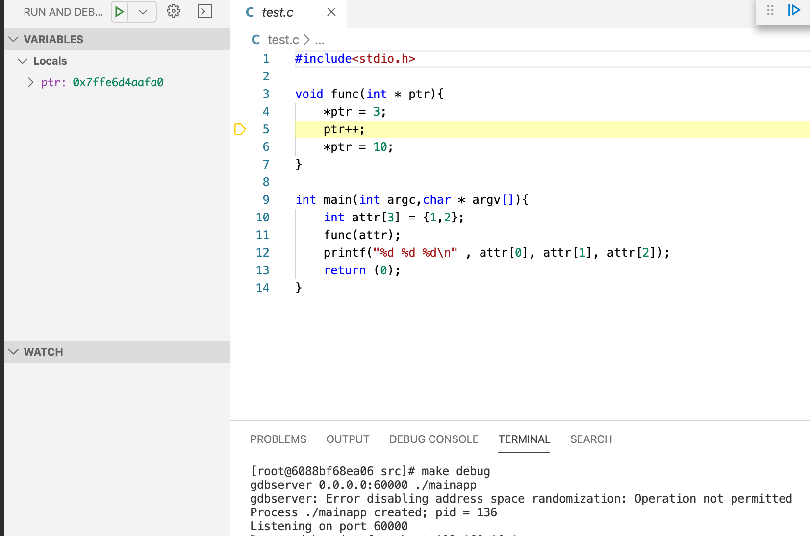

### Debug your Application under Docker Environment
Firstly, create a vscode workspace and move the `launch.json` into your `.vscode` directory

#### StartUp
Build && Run the container:
```bash
docker-compose build && docker-compose up -d
```
Dive into Container Environment
```bash
docker-compose exec gdbenv bash
[root@6088bf68ea06 /]# cd /src/
[root@6088bf68ea06 src]# make all
gcc -g test.c -o mainapp
[root@6088bf68ea06 src]# make debug
gdbserver 0.0.0.0:60000 ./mainapp
gdbserver: Error disabling address space randomization: Operation not permitted
Process ./mainapp created; pid = 189
Listening on port 60000
```

#### Run Debug Plugin under VSCode
